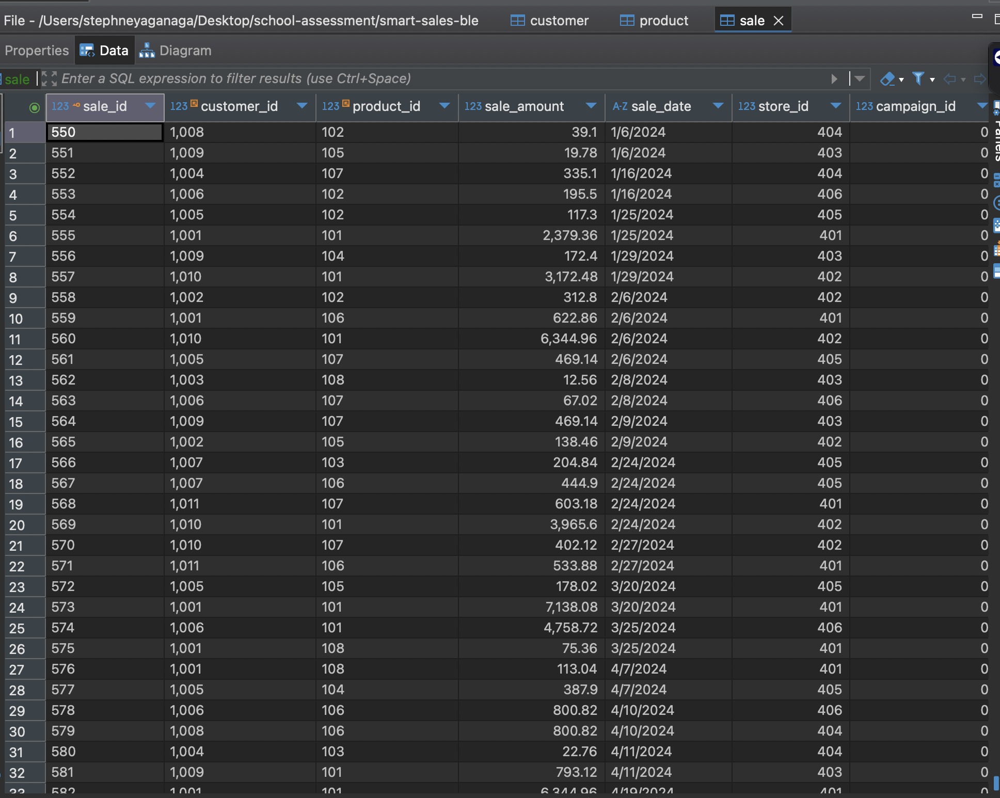
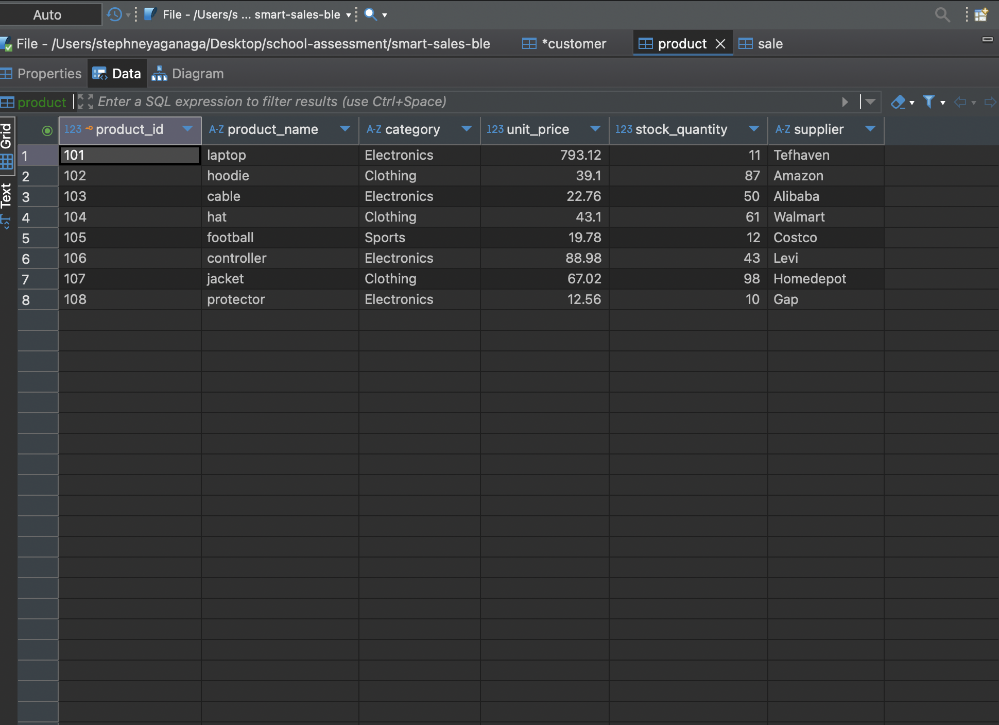
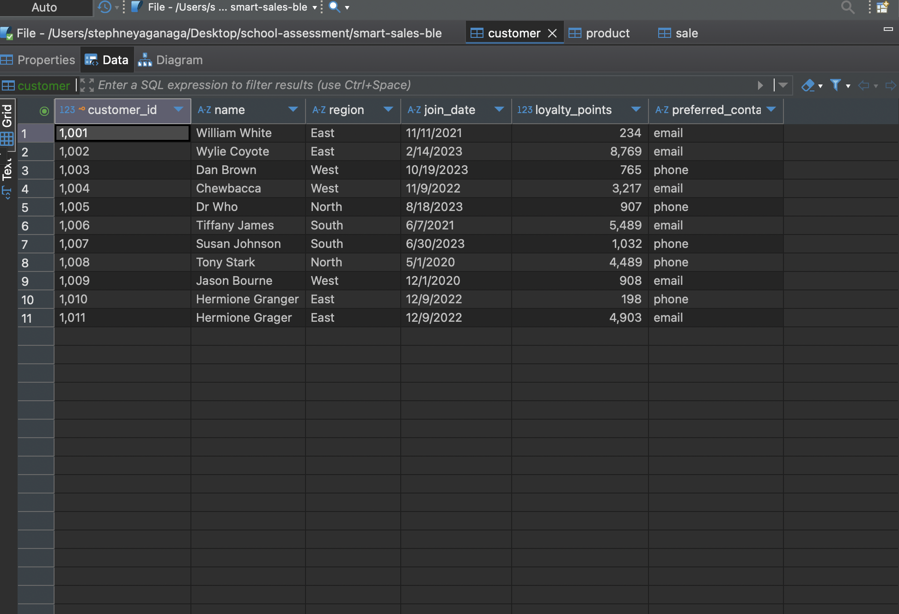

# smart-store-blessing
# 01-git-pull-before-changes.md

Before making any changes to a project, ALWAYS pull the latest changes from the remote repository on GitHub. Keep both locations up-to-date and in sync. 

Pulling ensures that:
- You work with the latest code.
- Merge conflicts are minimized.
- Collaboration stays smooth.

## Before Starting

Open your project repository in VS Code. 

We'll open a new terminal in VS Code and run a single command. 

## Task 1. Pull Changes

Run the following command from the project root directory. 
The command works in PowerShell, bash, zsh, Git Bash, and more. 

```shell
git pull origin main
```

Once configured, you might find that a shorter version works as well: `git pull`

Review the output for updates or conflicts. 
If there are conflicts, resolve them before proceeding.
The best solution to merge conflicts is to AVOID them through a good workflow. 
# 02-activate-virtual-environment.md

ALWAYS activate the .venv before working on the project.Activate whenever you open a new terminal. 

## Before Starting

Open your project repository in VS Code. 

We'll open a new terminal in VS Code and run a single command. 

## Windows Machines: Task 1. Activate

Run the following command from the project root directory. 
The command works in PowerShell.

```powershell
.venv\Scripts\activate
```

## Mac/Linux Machines: Task 1. Activate

Run the following command from the project root directory. 
The command works in zsh, bash, and more.

```powershell
source .venv/bin/activate
```

## Verify
Confirm activation by checking that the terminal shows the environment name (e.g., (venv)).

## Recommendation

This command is a bit harder to memorize. Use the UP ARROW key to access prior commands in the terminal and keep good notes in your README.md files. 
# 03-install-dependencies.md

This page explains how to install external dependencies for a Python project. 

## Python Standard Library
We do not need to install packages from the Python Standard Library - they are included with our version. The standard library includes helpful packages like pathlib, sqlite3, os, sys, time, and more. See the index. 

## External Dependencies
External dependencies are libraries, packages, and modules beyond the standard library and include common packages like pandas, numpy, seaborn, and matplotlib. 

These must be installed into our local project virtual environment to use them in our code. 

## Before Starting

Open your project repository in VS Code. 
Open a terminal. 
We must activate the .venv - if you've already done so, you don't need to rerun that command. 


## Windows Task 1: Activate/Upgrade/Install

1. Ensure .venv is active.
2. Update key packages.
3. Install dependencies from the requirements.txt file.

Run the following commands from the project root directory. 
The commands work in PowerShell.

```powershell
.\.venv\Scripts\activate
py -m pip install --upgrade pip setuptools wheel
py -m pip install -r requirements.txt
```


## Mac/Linux Task 1: Activate/Upgrade/Install

1. Ensure .venv is active.
2. Update key packages.
3. Install dependencies from the requirements.txt file.

Run the following commands from the project root directory. 
The commands work in zsh, bash, and more.

```powershell
source .venv/bin/activate
python3 -m pip install --upgrade pip setuptools wheel
python3 -m pip install -r requirements.txt
```

## Dependencies Evolve Over Time
Which external packages we need tend to evolve over time.
We don't always know the full list when we begin. 
For example, it's common to add in matplotlib or seaborn once we have interesting results to visualize.

## Experience
Learn how and when to add external dependencies to requirements.txt and repeat this process as needed to make use of the powerful free ecosystem for Python projects. 
Explore popular external packages like requests and more to see why they get used. 
# 06-git-add-commit-push.md

This page provides instructions to add files to version control, commit changes, and push them to your remote repository.

- git add - stages changes, adds files to source control
- git commit - creates a labeled snapshot of staged changes.
- git push - updates the remote repository

## Before Starting

Ensure your project repository is open in VS Code, and you have made useful changes.

## Task 1. Git add-commit-push

Using a terminal in VS Code (PowerShell, zsh, or bash).

IMPORTANT: 
Replace the commit message with a clear and descriptive note about what you added or changed.
Wrap the commit message in double quotes. 

```shell
git add .
git commit -m "Add .gitignore and requirements.txt files"
git push -u origin main
```

After subsequent changes, you may be able to use a simpler version of the last command:

```shell
git push
``` 


## Experience

Experience comes from executing these commands frequently after making useful changes to a project. 
# SQLite Data Warehouse

## Project Overview

This project involves designing and implementing a **Data Warehouse** using SQLite. It includes:

- Schema creation
- ETL (Extract, Transform, Load) scripting
- Data validation and testing

## Database Schema

The schema is designed to support efficient data storage and retrieval. The key components include:

- **Fact Tables**: Stores transactional data.
- **Dimension Tables**: Contains categorical details for analysis.

## ETL Process

The ETL pipeline follows these stages:

1. **Extract**: Data is sourced from various input sources.
2. **Transform**: Data is cleaned and formatted to match the schema.
3. **Load**: Transformed data is inserted into the warehouse.

## Validation & Testing

- **Schema validation** ensures data integrity.
- **Automated testing** checks for consistency and accuracy.
- **Performance benchmarking** ensures optimized queries.

## Setup & Installation

To set up the SQLite data warehouse:

1. Clone this repository:
   ```sh
   git clone https://github.com/teflxndxn/smart-sales-blessing
   ```
2. Install SQLite if not already installed.
3. Execute the schema script using Python 3:
   ```sh
   python3 scripts/etl_to_dw.py
   ```

## Usage Instructions

- Run ETL scripts using Python or shell scripts.
- Query data using SQL for reporting and analytics.
- Validate results with test scripts.

## Database Table Preview



## Database Table Preview


### Products Table



### Customers Table

